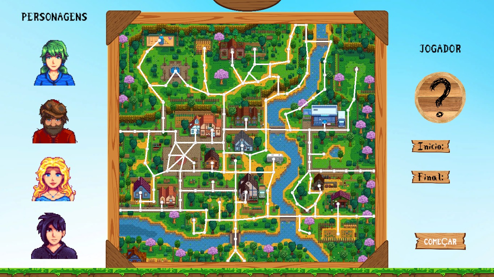
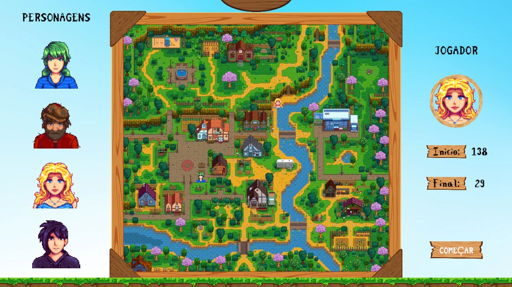
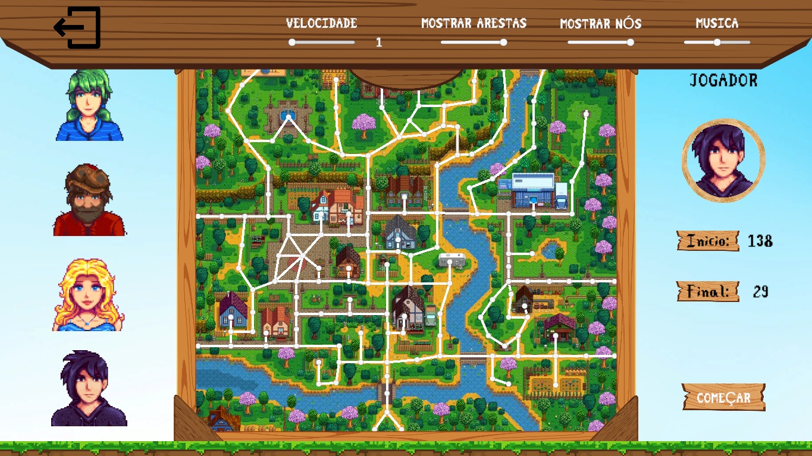

# Maps da Vila Pelicanos

**Número da Lista**: X 
**Conteúdo da Disciplina**: Grafos 1 

## Alunos
|Matrícula | Aluno |
| -- | -- |
| 21/1043467  |  Giovanni Alvissus Camargo Giampauli |
| 21/1031092  |  Larissa Gomes Silva |

## Sobre 
Os habitantes da Vila Pelicanos precisam constantemente se locomover o mais rápido por ela para chegar nas lojas antes de fecharem, ou encontrar o melhor caminho para dar um presente a outro habitante. Pensando nisso, foi criado um Maps da Vila Pelicanos, para que consigam chegar o mais rápido possível pelo menor caminho ao seu destino. Video explicando o projeto se encontra [aqui](https://drive.google.com/file/d/1q9IpBAurN5r5W9EK32KJo3wVC-d1Zk0p/view?usp=sharing).

## Screenshots
Tela inicial para seleção dos dados, em caso de dúvidas ver sessão de Uso

Tela com os dados selecionados 

Menu de configurações

## Instalação 
**Linguagem**: C# 
Pré-requisitos: 
- Para rodar o projeto como exe, basta ter SO Windows ou possuir biblioteca para rodar exe no Linux.
- Para rodar o código no computador, é necessário usar a Unity

## Uso 
Após baixar e iniciar o arquivo .exe, irá aparecer um menu inicial. Ao iniciar o jogo, o usuário deve selecionar um personagem no painel esquerdo, após isso informar quais os nós de inicio e fim clicando no botão início/fim e em seguida no nó escolhido no mapa. Há um painel de controle para regular o volume da música de fundo, além da opacidade das arestas e vértices sobre o mapa da vila e a velocidade de locomoção do aldeão escolhido.

